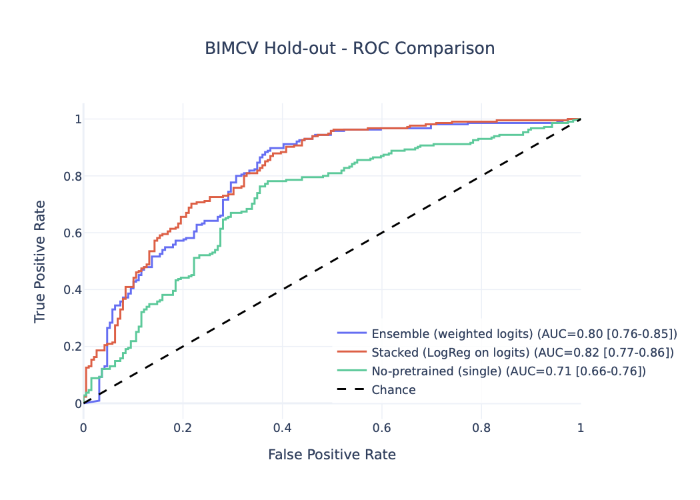

# BIMCV-Prostate-Classification
A Repository Containing the code used to classify Clinically Significant Prostate Cancer on BIMCV Prostate MRI Dataset.

<p align="center">
  
</p>

## Table of Contents

- [Introduction](#introduction)
- [Dataset](#dataset)
- [Models](#models)
- [Methodology](#methodology)
- [Results](#results)
- [Dependencies](#dependencies)
- [Installation](#installation)
- [Repository Structure](#repository-structure)
- [Usage](#usage)
- [Interpretability Reports](#interpretability-reports)
- [References](#references)
- [Grants and Funding](#grants-and-funding)

## Introduction

Prostate cancer is a leading cause of cancer-related death among men worldwide. Accurate detection and classification of csPCa using MRI are crucial for diagnosis, treatment planning, and monitoring. This project introduces AI-based models designed to improve the detection of csPCa using MRI.

## Dataset

The datasets used in this project include the [PI-CAI Challenge dataset](https://zenodo.org/records/6624726) [1] and MRI images and clinical data from over 8,000 subjects from the BIMCV Prostate dataset. The dataset is structured using the Medical Imaging Data Structuring (MIDS) framework to ensure robustness and diversity.

## Models

### 3D EfficientNet-B7 (Classification)

A 3D EfficientNet-B7 model is adapted and trained for classifying csPCa from multiparametric MRI scans. The model leverages transfer learning from the PI-CAI dataset to enhance performance. It was adapted using MONAI 1.2.0.

## Methodology

1. **Data Preprocessing:** Image normalization, augmentation, and prostate zone segmentation.
2. **Model Training:** Utilization of advanced deep learning techniques, including Vision Transformers and Transfer Learning.
3. **Model Evaluation:** Benchmarking against other models and applying interpretability techniques such as occlusion sensitivity and guided backpropagation.

## Results

The 3D EfficientNet-B7 model achieved an AUC of 0.82 in the validation set.
<p align="center">
  
</p>
Generated figures and JSON metrics are stored under `outputs/figures/` and `outputs/results/`.
Additional comparison plots are under `outputs/figures/results/`.

## Dependencies

The current release depends on the following Python libraries:

- monai == 1.2.0
- numpy == 1.23.4
- pandas == 2.1.0
- prettytable == 3.9.0
- ptflops == 0.7
- pygad == 3.2.0
- tensorboard == 2.8.0
- torch == 1.12.1
- torchmetrics == 1.1.2
- torchvision == 0.13.1
- tqdm == 4.62.3

Notebook analysis also uses:
- plotly
- kaleido (static export requires Chrome or `kaleido.get_chrome()`)
- ipywidgets (for tqdm progress bars in notebooks)

## Installation

To set up the project environment and code you can install [BIMCV_AIKit](https://github.com/BIMCV-CSUSP/BIMCV-AIKit):

```bash
git clone https://github.com/BIMCV-CSUSP/BIMCV-AIKit.git
cd BIMCV-AIKit
pip install -e .
```

Then, from this repository root, install the local package so modules under `src/` are importable:
```bash
pip install -e .
```

## Repository Structure

- `src/bimcv_prostate/` - Core library
  - `data/` - Loaders and transforms
  - `models/` - Model definitions
  - `training/` - Train/averaging utilities
  - `utils/` - Path mapping and config helpers
  - `interpretability/` - Shared report generation utilities
  - `experiments/clinical/` - Clinical variable experiments
- `configs/` - Training configs (JSON)
- `scripts/` - CLI entrypoints (train, eval, average_model, interpretability)
- `notebooks/` - Analysis notebooks
- `outputs/` - Generated artifacts (results, figures, reports)

## Usage

1. **Data Preparation:** Ensure the dataset is available and structured as required. All data preparation and analysis can be found in the Data Structuring and Data Analysis folders.

2. **Training:** For pre-training with the PI-CAI dataset, download The PI-CAI Challenge: Public Training and Development Dataset. Pretrain using BIMCV-AIKit with:
```bash
bimcv_train -c configs/config_picai.json
```
or
```bash
python -m bimcv_aikit.training.train -c configs/config_picai.json
```
Finally, with the pretrained model, update `pretrained_weights_path` in `configs/config.json` and train on BIMCV:
```bash
bimcv_train -c configs/config.json
```
You can also use the helper wrapper:
```bash
python scripts/train.py --config configs/config.json
```
3. **Evaluation:** Run the main analysis notebook or execute it via the helper script:
```bash
python scripts/eval.py --notebook notebooks/Analize_Results.ipynb
```
4. **Model Averaging:** Build an averaged backbone from fold checkpoints:
```bash
python scripts/average_model.py --fold path/to/fold0.pth --weight 0.25 --fold path/to/fold1.pth --weight 0.25
```
5. **Clinical Variables Experiments:** Use the clinical configs under `configs/clinical/`:
```bash
bimcv_train -c configs/clinical/config.json
```

## Interpretability Reports

Two scripts generate per-patient PDF interpretability reports using MONAI visualization methods (Grad-CAM++, Guided Grad-CAM, occlusion sensitivity, and guided backpropagation):

- `scripts/interpretability.py` - Merges all available segmentations for a session into a single ground-truth mask.
- `scripts/interpretability_2.py` - Loads all available segmentations and overlays them as multiple contours.

Both scripts now share the same core logic under `src/bimcv_prostate/interpretability/report_generator.py` to match the project structure and reduce duplication.

### Prerequisites

Before running either script, confirm the following:

- You installed the local package with `pip install -e .` from the repository root.
- `../Files/data_interpretability.csv` exists and includes a `partition` column with a `val` split.
- The CSV columns `t2`, `adc`, and `dwi` are valid paths after rewrites.
- The XNAT session root exists at `../Files/data/validation/descargas_xnat_segura/`.
- The model checkpoints listed inside each script under `MODEL_PATHS` exist on disk.

### Run (Examples)

From the repository root:

```bash
python3 scripts/interpretability.py --limit 1 --start-index 0
```

```bash
python3 scripts/interpretability_2.py --limit 1 --start-index 0
```

### Outputs

- Reports are written to `../Results/Patient_Reports_PDF/`.
- Filenames follow `{ID_XNAT_session}_Report.pdf` when that column is available; otherwise they use `Patient_{index}`.
- If a report already exists, a numeric suffix is appended (for example, `_Report_1.pdf`).

### Configuration Notes

Key settings live near the top of each script in `REPORT_CONFIG`:

- `target_layer` controls the Grad-CAM++ layer.
- `channel_index` selects the background channel shown in the report (for example, ADC).
- `class_index` selects the class to explain.
- `path_rewrites` must match the data layout used by `ProstateImageDataLoader`.

If you want to change shared behavior, prefer editing `src/bimcv_prostate/interpretability/report_generator.py` rather than duplicating logic inside the scripts.

## References
[1] A. Saha, J. S. Bosma, J. J. Twilt, B. van Ginneken, A. Bjartell, A. R. Padhani, D. Bonekamp, G. Villeirs, G. Salomon, G. Giannarini, J. Kalpathy-Cramer, J. Barentsz, K. H. Maier-Hein, M. Rusu, O. Rouvière, R. van den Bergh, V. Panebianco, V. Kasivisvanathan, N. A. Obuchowski, D. Yakar, M. Elschot, J. Veltman, J. J. Fütterer, M. de Rooij, H. Huisman, and the PI-CAI consortium. “Artificial Intelligence and Radiologists in Prostate Cancer Detection on MRI (PI-CAI): An International, Paired, Non-Inferiority, Confirmatory Study”. The Lancet Oncology 2024; 25(7): 879-887.

## Grants and Funding
Funded by the Spanish Ministry of Economic Affairs and Digital Transformation (Project MIA.2021.M02.0005 TARTAGLIA, from the Recovery, Resilience, and Transformation Plan financed by the European Union through Next Generation EU funds). TARTAGLIA takes place under the R&D Missions in Artificial Intelligence program, which is part of the Spain Digital 2025 Agenda and the Spanish National Artificial Intelligence Strategy.
